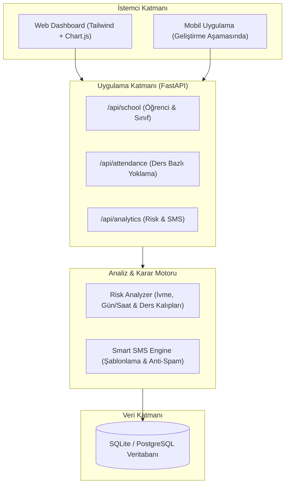

# 🛡️ Devam Takip

> **Öğrenci Devamsızlık Analizi, Erken Uyarı ve Veli SMS Bildirim Sistemi**  
> *Student Attendance Risk Analysis & Early Warning System*


---

## 📖 Proje Hakkında

**Devam Takip**, öğrencilerin yalnızca toplam devamsızlık gün sayısını tutan klasik sistemlerin ötesine geçer. Her ders oturumu bazında toplanan verileri zaman serisi ve korelasyon analizine tabi tutarak **öğrencinin dönem sonunda başarısız olmasını beklemeden** risk durumunu tespit eden bir **Erken Uyarı Sistemi (Early Warning System)** sunar.

Sistem; son haftalardaki ani devamsızlık artışlarını, Pazartesi/Cuma günleri ardışık devamsızlık desenlerini ve belirli derslere yönelik kaçışları analiz eder; kritik risk seviyesine ulaşan öğrencilerin velilerine otomatik veya tek tıkla **akıllı SMS bilgilendirmesi** gönderir.

---

## ✨ Temel Özellikler

- 📊 **Oturum & Ders Bazlı Veri Modeli:** Sadece günlük değil, her ders saati (1. ders, 2. ders...) bazında detaylı yoklama kaydı.
- ⚡ **Hızlı Yoklama Arayüzü (Öğretmen Dostu):** "Tümünü Geldi Yap" butonu ile öğretmenin sadece gelmeyen veya geç kalan öğrencilere dokunarak 10 saniyede yoklama almasını sağlayan arayüz.
- 🧠 **Erken Uyarı & Risk Skoru Motoru (0 - 100):**
  - **İvme (Hızlanma) Analizi:** Son 14 gündeki devamsızlık hızının önceki dönemle karşılaştırılması.
  - **Kalıp (Pattern) Tespiti:** Pazartesi / Cuma günlerine kümelenen devamsızlıklar (hafta sonu uzatma eğilimi).
  - **Ders Odaklı Kaçış:** Öğrencinin sadece belirli bir derse (örn. Matematik) katılmama durumunun tespiti.
  - **Sabah Geç Kalma Tespiti:** İlk ders saatlerine yönelik sistematik geç kalmalar.
- 📱 **Akıllı SMS Bildirim Sistemi:**
  - Tespit edilen risk faktörüne özel dinamik mesaj şablonları üretimi.
  - **Anti-Spam (Frekans Sınırlama):** Aynı veliye 24 saat içinde tekrar tekrar SMS atılıp bıkkınlık yaratılmasını engelleyen güvenlik filtresi.
  - Geliştirme ortamı için **Mock SMS Sağlayıcı**, canlı ortam için hazır SMS API entegrasyon altyapısı.
- 📈 **Görsel Dashboard & Isı Haritaları:**
  - Günlere göre devamsızlık yoğunluğu grafiği.
  - Ders saatlerine göre devamsızlık trend çizgisi.
  - Risk seviyesi dağılım piramidi.

---

## 🏗️ Mimari Şema



---

## 🚀 Hızlı Başlangıç

### 1. Gereksinimler
- Python 3.10+
- Git

### 2. Kurulum

```bash
# Repoyu klonlayın
git clone https://github.com/nihathan/devam-takip.git
cd devam-takip

# Sanal ortam oluşturup aktif edin
python -m venv venv

# Windows için:
.\venv\Scripts\activate
# macOS/Linux için:
source venv/bin/activate

# Gerekli paketleri yükleyin
pip install -r backend/requirements.txt
```

### 3. Örnek Demo Verilerini Yükleme
Gerçekçi öğrenci profilleri, sınıflar ve 4 haftalık yoklama trendlerini oluşturmak için:

```bash
python backend/seed_data.py
```

### 4. Uygulamayı Başlatma

```bash
python run.py
```

Tarayıcınızda açın:
- 🌐 **Web Paneli:** [http://localhost:8000](http://localhost:8000)
- 📑 **Swagger API Dokümantasyonu:** [http://localhost:8000/docs](http://localhost:8000/docs)

---

## 🗂️ Proje Dizin Yapısı

```
devam-takip/
├── backend/
│   ├── app/
│   │   ├── api/             # API uç noktaları (Öğrenci, Yoklama, Analitik)
│   │   ├── services/        # Risk analiz algoritması ve SMS servisi
│   │   ├── database.py      # Veritabanı bağlantısı (SQLAlchemy)
│   │   ├── models.py        # Veritabanı ORM tabloları
│   │   ├── schemas.py       # Pydantic veri modelleri
│   │   └── main.py          # FastAPI ana uygulama
│   ├── requirements.txt     # Python bağımlılıkları
│   └── seed_data.py         # Test & demo verisi üreteci
├── frontend/
│   └── index.html           # Modern responsive web dashboard
├── run.py                   # Tek tıkla sunucuyu başlatan betik
├── .gitignore
├── LICENSE                  # MIT Lisansı
└── README.md
```

---

## 🗺️ Yol Haritası (Roadmap)

- [x] Ders ve oturum bazlı yoklama veri modeli
- [x] Zaman serisi ve ivme bazlı risk analizi algoritması
- [x] Akıllı SMS uyarı motoru ve anti-spam filtresi
- [x] Responsive Web Yönetici ve Öğretmen Paneli
- [x] Görsel analiz grafikleri (Chart.js)
- [ ] Rehberlik servisi için görüşme randevu takip takvimi
- [ ] Netgsm / Twilio gerçek SMS API entegrasyonu
- [ ] Mobil Uygulama (React Native / Expo ile veli ve öğretmen ekranları)

---

## 📄 Lisans

Bu proje [MIT Lisansı](LICENSE) kapsamında lisanslanmıştır.
